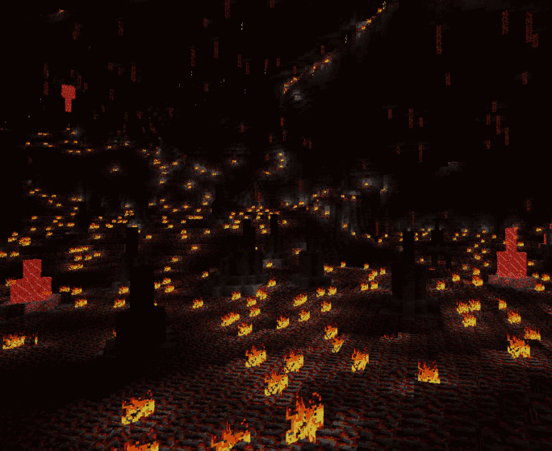

Minetest mod caverealms lite
=====================

BIOME underground realms mod

Information
-----------

This mod generates underground realms, borrowing from the concepts of skylands, creates
huge underground caverns that extend for hundreds of blocks. Within these caverns
lie stalagmites of glowing crystals, small glowing gems littering the floor, and variable terrain.

Technical information
---------------------

Based on the original minetest-caverealms mod (https://github.com/HeroOfTheWinds/minetest-caverealms/).
adds underground realms to minetest.

**Features** This caverealms fork provides all the biomes and decorations from the original caverealms,
with several additions and without the overhead of generating caves. This lowers the server
resources the mod requires, for example CPU and RAM.

**Aliquot** This also removes the large lava spills created by the original caverealms.

**Notes** It was specifically written to work with the mgvalleys mapgen, but will work using other
mapgens as well. The mapgen used will determine the shape and size of individual caves.
Mapgens that generate only smaller caves may be less suitable for use with this fork than mgvalleys.

**Warning**: For worlds where the original caverealms is already in use, this fork is not advised
as a replacement. If used in this way, some unknown nodes and other minor issues should be expected.

**Lucky Blocks**: 4

### Depends

* default

optional_depends

* fire
* ethereal
* stairs
* mobs

Recommends:

- VanessaE's HDX texturepacks provide alternative textures. For example,
https://gitlab.com/VanessaE/hdx-128.
- ethereal: unlocks additional content (https://notabug.org/tenplus1/ethereal).
- mobs: mobs_redo is required to run mobs_monster (https://notabug.org/tenplus1/mobs_redo).
- mobs_monster: allows Dungeon Masters to spawn in the Dungeon Master's Lair biome (https://notabug.org/tenplus1/mobs_monster).
- abritorch: adds coloured torches made with caverealms items (https://github.com/Ezhh/abritorch).

### Crafts

**glow mese**

* output = "default:mese_crystal_fragment 8",
* recipe =

	{{"caverealms:glow_mese"}}

**thin ice to water**

* output = "default:water_source"
* recipe =

    {{"caverealms:thin_ice"}}

**coal dust block**

* output = "default:coalblock",
* recipe =

    {"caverealms:coal_dust","caverealms:coal_dust","caverealms:coal_dust"}
    {"caverealms:coal_dust","caverealms:coal_dust","caverealms:coal_dust"}
    {"caverealms:coal_dust","caverealms:coal_dust","caverealms:coal_dust"}

**Dungeon Master statue**

* output = "caverealms:dm_statue",
* recipe =

    {"caverealms:glow_ore","caverealms:hot_cobble","caverealms:glow_ore"},
    {"caverealms:hot_cobble","caverealms:hot_cobble","caverealms:hot_cobble"},
    {"caverealms:hot_cobble","caverealms:hot_cobble","caverealms:hot_cobble"}

**Glow obsidian brick**

* output = "caverealms:glow_obsidian_brick 4",
* recipe =

    {"caverealms:glow_obsidian", "caverealms:glow_obsidian"},
    {"caverealms:glow_obsidian", "caverealms:glow_obsidian"}

* output = "caverealms:glow_obsidian_brick_2 4",
* recipe =

    {"caverealms:glow_obsidian_2", "caverealms:glow_obsidian_2"},
    {"caverealms:glow_obsidian_2", "caverealms:glow_obsidian_2"}

**Glow obsidian glass**

* output = "caverealms:glow_obsidian_glass 5",
* recipe =

    {"default:glass", "default:glass", "default:glass"},
    {"default:glass", "default:glass", "caverealms:glow_obsidian"}
..or..
    {"default:glass", "default:glass", "default:glass"},
    {"default:glass", "default:glass", "caverealms:glow_obsidian_2"}

### AMBs

| Biome                    | Nodes on map      |
| ------------------------ | ----------------- |
| Caverealms grow sapling  | ethereal:mushroom_sapling, caverealms:mushroom_sapling |
| Caverealms stone spread  | caverealms:stone_with_moss, caverealms:stone_with_lichen, caverealms:stone_with_algae |

### Nodes

| node provided               | Node Name            | Notes     |
| --------------------------- | -------------------- | --------- |
| caverealms:fungus           | Glowing Fungus       |           |
| caverealms:mycena           | Mycena Mushroom      |           |
| caverealms:mushroom_stem    | Giant Mushroom Stem  |           |
| caverealms:mushroom_cap     | Giant Mushroom Cap   |           |
| caverealms:mushroom_gills   | Giant Mushroom Gills |           |
| caverealms:mushroom_sapling | Mushroom Sapling     |           |
| caverealms:glow_crystal     | Glow Sapphire        |           |
| caverealms:glow_emerald     | Glow Emerald         |           |
| caverealms:glow_mese        | Glow Mese Crystal    |           |
| caverealms:glow_ruby        | Glow Ruby            |           |
| caverealms:glow_amethyst    | Glow Amethyst        |           |
| caverealms:glow_ore         | Glow Crystal Ore     |           |
| caverealms:glow_emerald_ore | Glow Emerald Ore     |           |
| caverealms:glow_ruby_ore    | Glow Ruby Ore        |           |
| caverealms:glow_amethyst_ore | Glow Amethyst Ore   |           |
| caverealms:thin_ice         | Thin Ice             |           |
| caverealms:salt_crystal     | Salt Crystal         |           |
| caverealms:glow_gem         | Glow Gem             |           |
| caverealms:salt_gem         | Salt Gem             |           |
| caverealms:spike            | Stone Spike          |           |
| caverealms:icicle_up        | Icicle               |           |
| caverealms:icicle_down      | Icicle               |           |
| caverealms:stone_with_moss  | Cave Stone with Moss  |          |
| caverealms:stone_with_lichen | Cave Stone with Lichen  |         |
| caverealms:stone_with_algae | Cave Stone with Algae |          |
| caverealms:stone_with_salt  | Salt Crystal         |           |
| caverealms:hot_cobble       | Hot Cobble           |           |
| caverealms:glow_obsidian    | Hot Glowing Obsidian |           |
| caverealms:glow_obsidian_2  | Hot Glow Obsidian    |           |
| caverealms:glow_obsidian_brick | Glowing Obsidian Brick  |           |
| caverealms:glow_obsidian_brick_2 | Glow Obsidian Brick  |           |
| caverealms:glow_obsidian_glass   | Glow Obsidian Glass  |           |
| caverealms:coal_dust         | Coal Dust           |           |
| caverealms:glow_worm         | Blue Glow Worms     |           |
| caverealms:glow_worm_green   | Green Glow Worms    |           |
| caverealms:fire_vine         | Fire Vine           |           |
| caverealms:constant_flame    | Fire                |           |
| caverealms:dm_statue         | Dungeon Master Statue  |           |

### Alias

| node provided               | falback replacement     | Mod        | Mod origin  |
| --------------------------- | ----------------------- | ---------- | ----------- |
| caverealms:constant_flame   | fire:permanent_flame    | fire       | tenplus1    |
| caverealms:hanging_thin_ice | caverealms:thin_ice     | caverealms | original    |
| caverealms:mushroom_cap     | ethereal:mushroom       | ethereal   | tenplus1    |
| caverealms:mushroom_stem    | ethereal:mushroom_trunk | ethereal   | tenplus1    |
| caverealms:spike_2          | caverealms:spike        | farming    | tenplus1    |
| caverealms:spike_3          | caverealms:spike        | farming    | tenplus1    |
| caverealms:spike_4          | caverealms:spike        | farming    | tenplus1    |
| caverealms:spike_5          | caverealms:spike        | farming    | tenplus1    |
| caverealms:salt_gem_2       | caverealms:salt_gem     | farming    | tenplus1    |
| caverealms:salt_gem_3       | caverealms:salt_gem     | farming    | tenplus1    |
| caverealms:salt_gem_4       | caverealms:salt_gem     | farming    | tenplus1    |
| caverealms:salt_gem_5       | caverealms:salt_gem     | farming    | tenplus1    |
| caverealms:glow_gem_2       | caverealms:glow_gem     | farming    | tenplus1    |
| caverealms:glow_gem_3       | caverealms:glow_gem     | farming    | tenplus1    |
| caverealms:glow_gem_4       | caverealms:glow_gem     | farming    | tenplus1    |
| caverealms:glow_gem_5       | caverealms:glow_gem     | farming    | tenplus1    |

License
-------

Check [LICENSE.txt](LICENSE.txt) file
